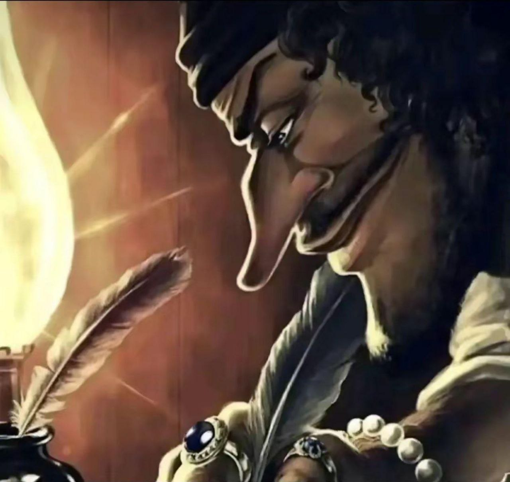

# 👋 Привет! Я Wtoni

Студент первого курса направления **Прикладной искусственный интеллект** в ИРИТ-РТФ.

---

## 🧠 Обо мне
- На самом деле я люблю многие вещи, но самые людимые из них:
  
- 📚 **Читаю**:  
  В основном мне нравиться фантастика и автобиографии, но время от времени и на другие жанры заносит)
  Любимый литературный жанр — **комедия**.

- 🌲 **Люблю природу**:  
  Особенно — долгие прогулки по лесу. Тишина, пение птиц и свежий воздух помогают мне собраться с мыслями.

- 🎮 **Геймер с детства**:  
  Играю в игры всех жанров, но чаще всего выбираю:
  - **RPG** (ролевые игры),
  - **Roguelikes** (рогалики),
  - **Visual novels** (визуальные новеллы).

## 🔭 Деятельность в университете 

- 💡 **Сейчас участвую** в хакатоне в роли **тимлида** команды, которая разрабатывает **AI-тренер выступлений** — инструмент для улучшения навыков публичных выступлений с помощью искусственного интеллекта.

### 

